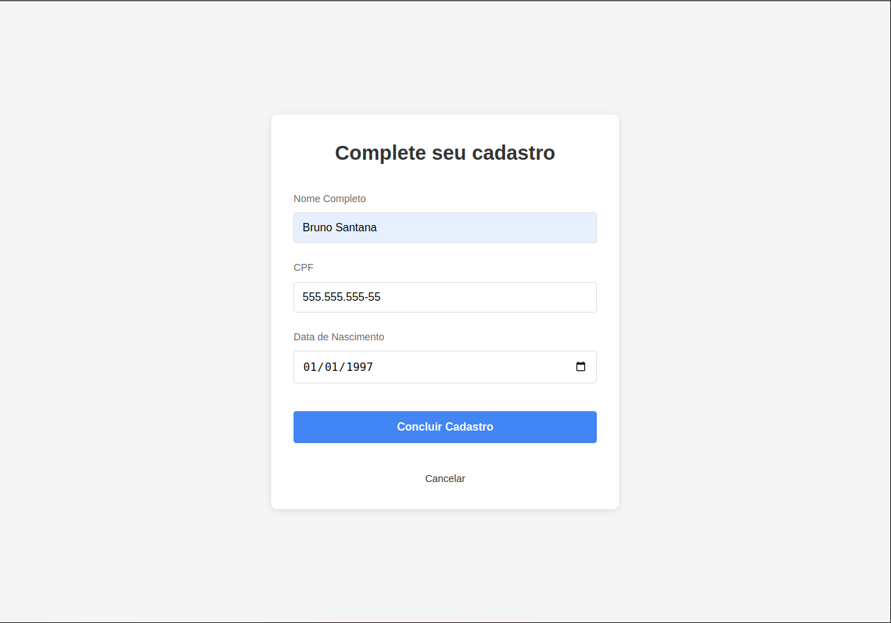
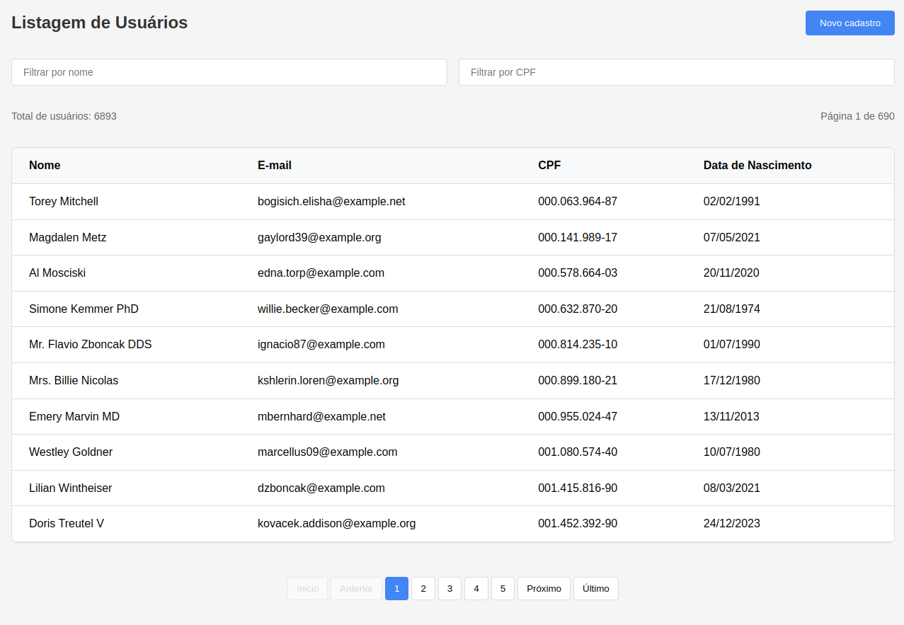

# Desafio Tray Frontend

## Pré-requisitos

- Docker e Docker Compose instalados

## Configuração

1. Clone o repositório:
```bash
git clone https://gitlab.com/brunno313/desafio-tray-frontend.git
cd desafio-tray-frontend
```
2. Crie um arquivo `.env` baseado no `.env.example`
```bash
cp .env.example .env
```
3. Configure a URL da API no `.env`:
```env
VITE_API_URL=http://localhost:9000
```

## Executando o projeto

1. Inicie os containers:
```bash
docker-compose up -d --build
```
2. Acesse a aplicação em http://localhost:3000.

## Rotas da aplicação

- Login com Google (redireciona para o backend). -> `http://localhost:3000/` ou `http://localhost:3000/login`
- Formulário de cadastro após autenticação. -> `http://localhost:3000/register`
- Listagem de usuários com filtros (nome e CPF) e paginação. -> `http://localhost:3000/users`

## Testando performance

- O backend já inclui 150.000 usuários fictícios. Use o campo de busca para testar a otimização.

## Rodando testes

Para rodar os testes unitários, rode o seguinte comando:
```bash
npm run test
```

## Como ficou

<details>
<summary>Tela inicial</summary>

</details>
<details>
<summary>Página de cadastro de usuário</summary>

</details>
<details>
<summary>Listagem de usuários cadastrados</summary>

</details>
<details>
<summary>Página de não encontrado</summary>

</details>
